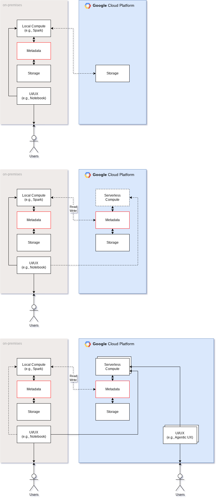

# Spark with BigLake Metastore

This repository provides two approaches for working with Google Cloud's BigLake Metastore and Apache Iceberg:

1. **Dataproc-based**: Full cloud setup with comprehensive data integration scenarios
2. **Docker-based**: Simplified local setup focusing on BigLake + Iceberg integration

## Overview

### Dataproc Approach (`dataproc_hdfs_hive_jupyter.ipynb`)
Comprehensive cloud-based setup showcasing integration of different data storage and management technologies:

-   Creating and managing Hive tables on HDFS and GCS
-   Creating and managing Iceberg tables with both Hive Metastore and BigLake Metastore
-   Pushing down computation to BigQuery from a Spark environment
-   Running serverless Spark jobs for data processing

### Docker Approach (`docker_iceberg_jupyter.ipynb`)
Simplified containerized setup for local development and testing:

-   Focus specifically on BigLake Metastore + Iceberg integration
-   Docker-based environment for consistent local setup
-   Supports both standard and REST API approaches
-   Ideal for demos, prototyping, and local testing

## Prerequisites

### For Dataproc Approach
-   A Google Cloud Platform (GCP) project
-   The `gcloud` command-line tool installed and configured
-   A GCS bucket for storing initialization scripts and data

### For Docker Approach
-   Docker and Docker Compose installed
-   A Google Cloud Platform (GCP) project
-   Service account key file with appropriate permissions
-   A GCS bucket for storing Iceberg data

## Setup & Usage

### Dataproc Setup
1.  **Clone the repository:**
    ```bash
    git clone git@gitlab.com:google-cloud-ce/googlers/johanesa/spark-hybrid-compute.git
    cd spark-hybrid-compute
    ```

2.  **Configure the notebook:**
    Open `dataproc_hdfs_hive_jupyter.ipynb` and replace placeholder values with your GCP project details.

3.  **Run the notebook:**
    Execute cells sequentially to provision cluster, run scenarios, and clean up resources.

### Docker Setup
1.  **Clone the repository** (same as above)

2.  **Configure the notebook:**
    Open `docker_iceberg_jupyter.ipynb` and update configuration with your GCP project details.

3.  **Run the notebook:**
    Execute cells to build Docker environment, configure Spark, and work with BigLake Iceberg tables.

## Scenarios

### Dataproc Scenarios
1.  **Hive Table from HDFS:** Creating a Hive table from data stored in HDFS
2.  **Iceberg Table from HDFS:** Creating an Iceberg table using the Hive metastore
3.  **Hive/Iceberg Table from GCS:** Creating a Hive or Iceberg table from data in Google Cloud Storage
4.  **Iceberg Table with BigLake Metastore:** Using BigLake Metastore to manage an Iceberg table
5.  **Push Down Computation to BigQuery:** Offloading query execution to BigQuery for efficiency
6.  **Serverless Spark Computation:** Running a data processing job using a serverless Dataproc cluster

### Docker Scenarios
1.  **BigLake Iceberg Tables:** Creating and managing Iceberg tables with BigLake metastore
2.  **REST API Integration:** Using BigLake REST API for Iceberg catalog operations
3.  **Local Development:** Testing Iceberg workflows in containerized environment

## Approach Comparison

| Feature | Dataproc Approach | Docker Approach |
|---------|------------------|-----------------|
| **Setup Complexity** | High (cloud resources) | Low (local containers) |
| **Cost** | Cloud compute charges | Local resources only |
| **Use Cases** | Production, full scenarios | Development, testing, demos |
| **Scope** | HDFS, Hive, Iceberg, BigQuery | BigLake + Iceberg focused |
| **Prerequisites** | GCP cluster setup | Docker installation |

## Cleanup

The final step in the notebook deletes the Dataproc cluster to prevent ongoing charges. Ensure you run this step after you have finished experimenting.

## Architecture

Below is a high-level architecture diagram of the solution.



## Additional details

TBA
